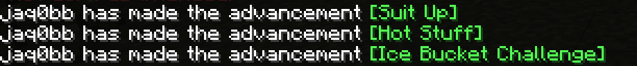
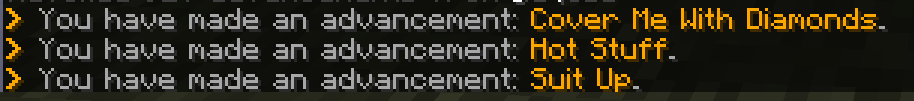

# Message Editor 
 

Message Editor is a Spigot plugin that allows editing in-game messages that were previously unmodifiable, in easy and fast way.

Click [here](https://www.spigotmc.org/resources/message-editor.82154/) to get to the project's SpigotMC page.

### Features

Message Editor supports:
* Editing chat messages - since 1.0.0
* Editing action bar messages - since 1.0.0
* Editing kick/disconnect messages - since 1.1.0
* Cancelling sending messages - since 1.2.4
* Editing boss bar titles - since 1.3.0 (requires server version at least 1.9)
* Triggering message editing only on specific positions - since 1.3.2
* Editing message positions - since 1.4.0
* Editing scoreboard titles - since 1.5.0
* Editing scoreboard entries - since 1.6.0
* Editing messages with GUI - since 2.0.0
* Editing inventory titles - since 2.2.0
* Editing inventory item names - since 2.3.0
* Editing inventory item lores - since 2.3.0
* Editing entity names - since 2.4.0
* Per-file message edit system - since 2.5.0

### Showcase

Images show first the original message and then the same message but after being edited using Message Editor.

### Usage

Basic message editing:

Message place editing:

Advanced message editing:

### Requirements

Message Editor requires:
* Server version at least 1.8
* ProtocolLib
* PlaceholderAPI (optional) - if you want to use placeholders in edited messages
* MVdWPlaceholderAPI (optional) if you want to use placeholders in edited messages
