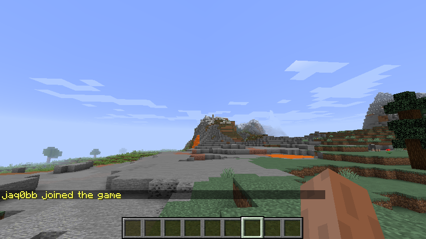
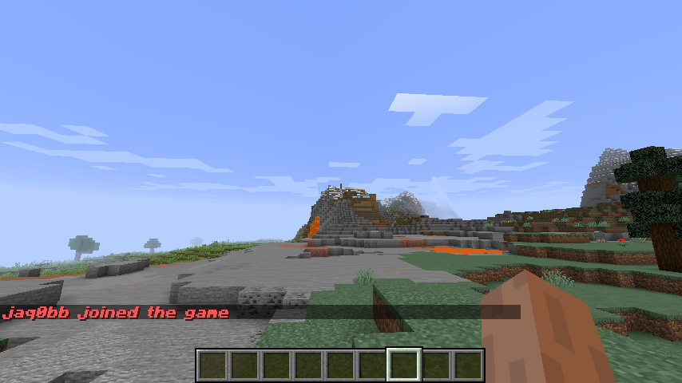
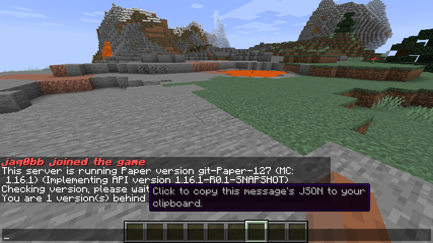
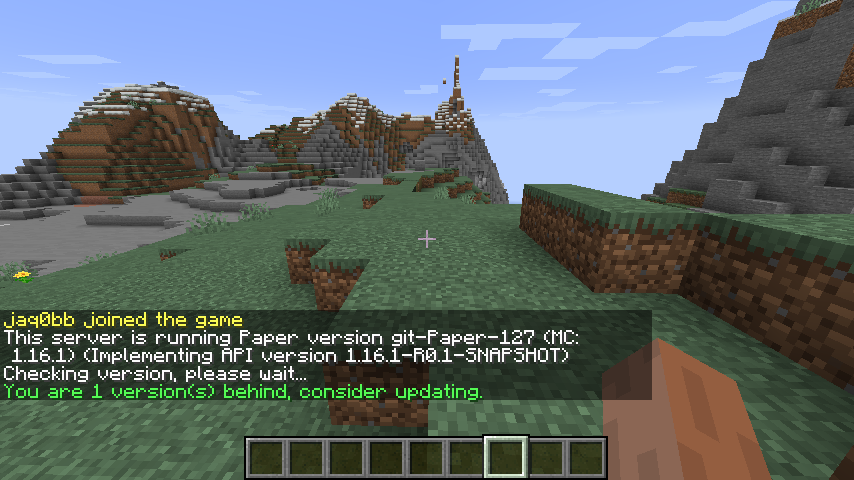

# Message Editor 
 [](https://opensource.org/licenses/MIT)

Message Editor is a Spigot plugin that allows editing in-game messages that were previously unmodifiable, in easy and fast way.

Click [here](https://www.spigotmc.org/resources/message-editor.82154/) to get to the project's SpigotMC page.

### Features

Message Editor supports:
* [x] Editing chat messages - since 1.0.0
* [x] Editing action bar messages - since 1.0.0
* [x] Editing kick/disconnect messages - since 1.1.0
* [x] Cancelling sending messages - since 1.2.4
* [x] Editing boss bar titles - since 1.3.0 (requires server version at least 1.9)
* [x] Triggering message editing only on specific positions - since 1.3.2
* [x] Editing message positions - since 1.4.0
* [x] Editing scoreboard titles - since 1.5.0
* [ ] Editing scoreboard entries

### Showcase



Join message before editing it using Message Editor.



Join message after editing it using Message Editor.

### Usage

Let us try to edit a message on a 1.16.1 server. We are gonna edit the /version message, "You are x version(s) behind" part to be more precise.

After running /version command and hovering over the message you want to edit you should see a hover message:



Now you can click this message, and you will have this message's JSON copied to your clipboard.

In this case you should end up with this JSON:

`\{"extra":\[\{"text":"You are 1 version\(s\) behind"\}\],"text":""\}`

This JSON is already ready for additional regex. If your message is static then you are already good to go and edit the message. In this case we are not ready since we can be behind more than 1 version.

We need to make the message more generalized, and we are gonna use regex to achieve that. If you do not know regex then you are probably gonna find this plugin useless.

We can replace `1` with `(\d+)`. This makes it accept all digits and not only `1`. This now also changed it to a sort of variable that we will be able to use in the new message.

This makes our JSON look like that:

`\{"extra":\[\{"text":"You are (\d+) version\(s\) behind"\}\],"text":""\}`

Now you can go and create your new message using i.e. special website.

I have created a new message that looks like that:

`{"extra":[{"color":"green","text":"You are $1 version(s) behind, consider updating."}],"text":""}`

Since we captured the number of versions we are behind, we can now also use it in the new message.

We are pretty much done. The only thing left is adding all we have done to the `message-edits` section in the config.yml file, so it looks like that in the end:
```yml
# Messages that should be edited.
# For in-depth tutorial check here:
# https://github.com/jaqobb/message-editor#usage
message-edits:
- ==: MessageEdit
  message-before-pattern: '\{"extra":\[\{"bold":false,"italic":false,"underlined":false,"strikethrough":false,"obfuscated":false,"color":"yellow","text":"([a-zA-Z0-9_]{3,16}) joined the game"\}\],"text":""\}'
  message-before-place: SYSTEM_CHAT
  message-after: '{"extra":[{"bold":true,"italic":true,"underlined":false,"strikethrough":false,"obfuscated":false,"color":"red","text":"$1 joined the game"}],"text":""}'
  message-after-place: ACTION_BAR
- ==: MessageEdit
  message-before-pattern: '\{"extra":\[\{"text":"You are (\d+) version\(s\) behind"\}\],"text":""\}'
  message-before-place: GAME_CHAT
  message-after: '{"extra":[{"color":"green","text":"You are $1 version(s) behind. Consider updating."}],"text":""}'
```

`==: MessageEdit` is for serialization purposes only.

`message-before-pattern` is a pattern to make sure we are editing the right message.

`message-before-place` is a place that the original message has to be sent from to be edited.

`message-after` is a new message you will see.

`message-after-place` is the place that the edited message will be sent to.

After this is done you should be able to see the new message after running /version command:



Keep in mind that you can use PlaceholderAPI and MVdWPlaceholderAPI in edited messages.

### Requirements

Message Editor requires:
* Server version at least 1.8
* ProtocolLib
* PlaceholderAPI (optional) - if you want to use placeholders in edited messages
* MVdWPlaceholderAPI (optional) if you want to use placeholders in edited messages
